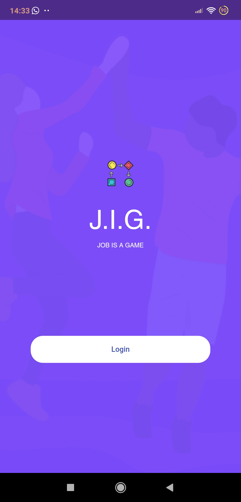
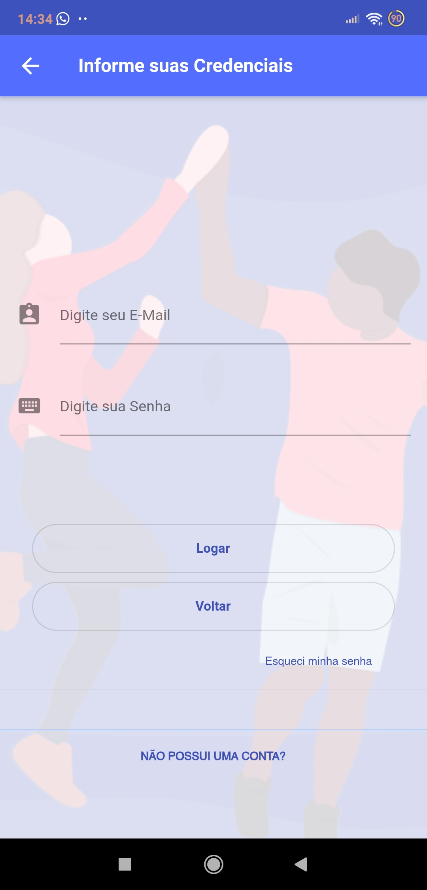
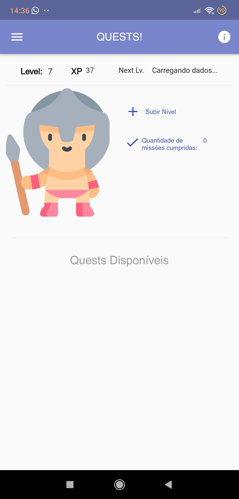
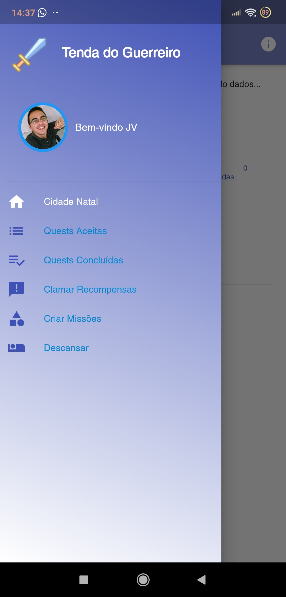

# JIG
Criado pelo discente Pedro Victor - IFMA
  
  
Este aplicativo foi desenvolvido para aplicação da gamificação em um setor de tecnologia da informação de uma empresa.
  
  
## Objetivo da aplicação:  
O objetivo da aplicação é a aplicação da gamificação em um setor de tecnologia da informação, visando tornar o ambiente de trabalho mais lúdico e motivador. A inserção da gamificação foi feita focado nas atividades, onde o colaborador realiza do cadastro das atividades desenvolvidas pelo setor, demonstrando um modelo simplificado de __*workflow*__ ao colaborador, indicando os principais processos a serem seguidos para a conclusão da tarefa. Ao fim, a mesma o recompensará com uma pontuação, que pode ser acumulada e trocada por recompensas dentro da aplicação.  
  
A gamificação foi inserida na aplicação através de diversos elementos como os **Pontos**, **Avatar**, **Progressão de Level** dentre outros.
  
  
## Tecnologias usadas:
Dentre as ferramentas usadas para a criação da aplicação, temos:  
  
- Dart (Linguagem de programação)
- Flutter (*framework*)
- Firebase (banco de dados)  
  
  
Bibliotecas:
- cloud_firestore: 0.12.9
- firebase_storage: 3.0.4
- google_sign_in: 4.0.4
- scoped_model: 1.0.1
- firebase_auth: 0.11.1+12
- rflutter_alert: 1.0.3
- image_picker: 0.6.1
- flutter_datetime_picker: 1.2.8
- photo_view: 0.9.0
- intl: 0.16.0
- flutter_launcher_icons: 0.7.4  
  
  
 ## Visão da aplicação
 
Abaixo temos algumas telas do sistema:  
    
###### Telas Iniciais

  
  
  

  
  
###### Usuário Logado  

  
  

 
  
  
  
###### Missão e  Workflow

  
  
  
  

  
